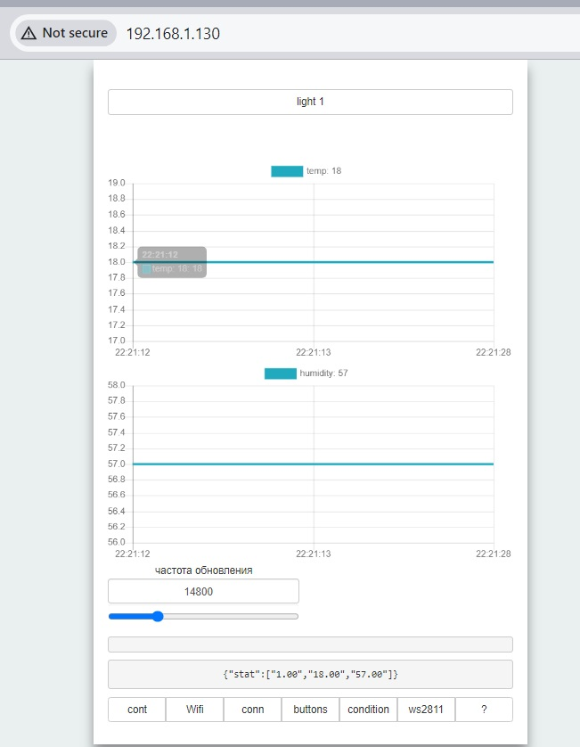
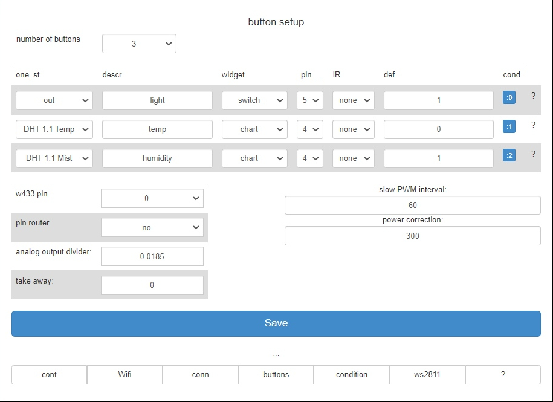
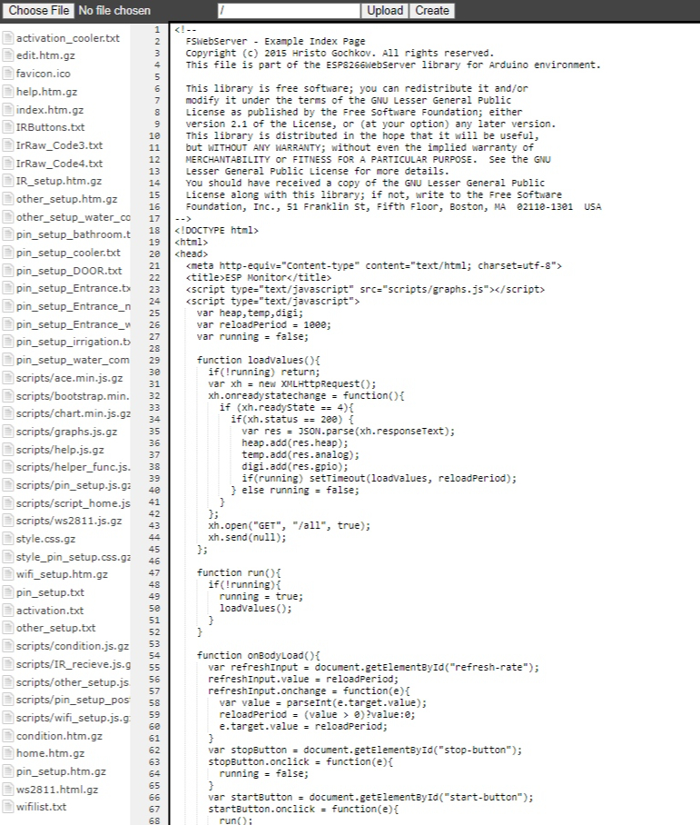
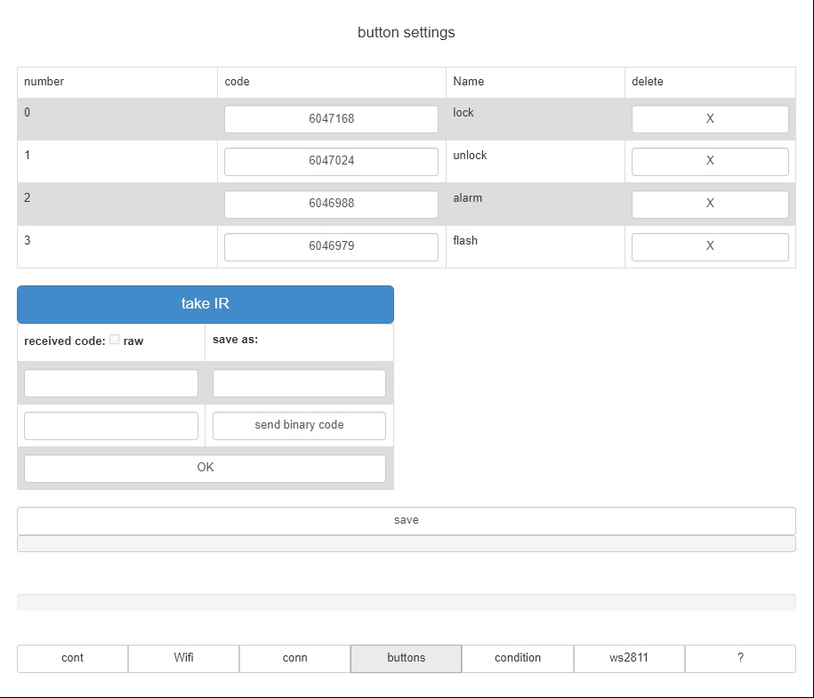
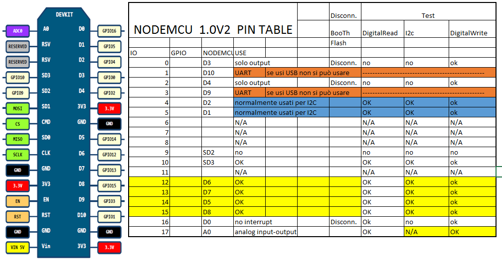

# EcoLogic Manager for ESP8266

Welcome to **EcoLogic Manager** – a no-coding-needed, web-based smart home controller for ESP8266. This project lets you control relays, sensors, IR devices, and more, all from a browser or MQTT, with easy setup and flexible configuration.

---

## 📦 Project Structure
- **EcoLogic_manager.ino**: Main firmware file (see this for pinouts, features, and defines)
- **HTML_data/**: Web UI files (served from device, edit and upload via LittleFS)
- **data/**: Gzipped web files for upload
- **pictures/**: Wiring, UI, and pinout images

---

## ✨ Features
- Web-based interface for setup and control (no app needed)
- MQTT, HTTP, and IR remote support
- Pinout and widget configuration from browser
- OTA updates, LittleFS filesystem
- Power monitoring, temperature/humidity sensors, IR learning, and more
- Node-RED and Home Assistant integration

---

## 🛠️ How to Start

1. **Hardware**
   - ESP8266 board (NodeMCU, Wemos D1 mini, etc.)
   - Power: 5V–12V (see `pictures/connection.jpg`)

2. **Install Tools**
   - [Arduino IDE 2.3.4](https://www.arduino.cc/en/software)
   - ESP8266 Boards package (v3.1.2)
   - LittleFS Uploader (install via Arduino IDE extensions)

3. **Board Setup in Arduino IDE**
   - Tools → Board: `Generic ESP8266 Module` (or your board)
   - Tools → Flash Size: `4MB (FS:1MB OTA:~1019KB)` (or as needed)

4. **Libraries Required**
   - ArduinoJson 6.15.2
   - CTBot 2.1.14
   - DallasTemperature 3.9.0
   - DHT sensor library for ESPx 1.19
   - EmonLib 1.1.0
   - FastLED 3.2.9
   - IRremoteESP8266 2.3.2
   - MAX6675 library 1.0.0
   - OneWire 2.3.8
   - PubSubClient 2.8
   - rc-switch 2.6.2
   - Time 1.6
   - WakeOnLan 1.1.6
   - WiFiManager 2.0.17
   - (See `EcoLogic_manager.ino` for all #define options)

5. **Prepare Filesystem**
   - Press `Ctrl+Shift+P` in Arduino IDE → `Upload LittleFS to ESP8266`
   - (Optional) Update web files: run `make_gz.ps1` in PowerShell to compress HTML_data to data/

6. **Flash the Firmware**
   - Open `EcoLogic_manager.ino` in Arduino IDE
   - Select the correct COM port
   - Upload to your ESP8266

7. **First Run & Setup**
   - Connect to the WiFi AP created by the device (SSID: `dev_001`, password: `12345678` by default)
   - Open `192.168.4.1` in your browser
   - Configure WiFi, pins, widgets, and other settings via the web UI
   - (See `pictures/help_page.jpg` for UI example)

8. **Advanced**
   - Update files in `data/` with `make_gz.ps1`
   - Explore `HTML_data/` for web UI customization
   - Node-RED and Home Assistant integration supported

---

## 📝 Board/IDE Version Notes
- 2024.12.28: Migrated to Arduino IDE 2.3.4, using LittleFS
- Arduino core: 2.6.3 → 3.1.2

---

## 🖼️ Screenshots
- Main page: 
- Button setup: 
- Edit page: 
- IR setup: 
- NodeMCU pinout: 

---

## 🔗 Resources
- [ESP8266 Documentation](https://www.espressif.com/en/products/socs/esp8266ex/resources)
- [Project GitHub](https://github.com/spspider/EcoLogic_manager)

---

> **Vibe on!** Install, connect, and let EcoLogic Manager handle your smart home magic. ✨