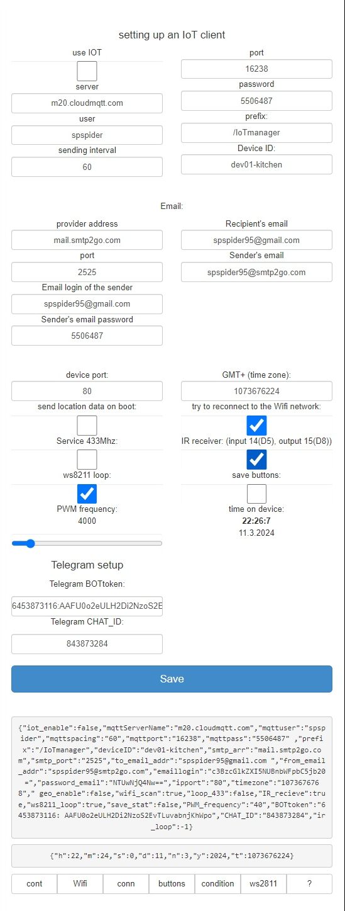
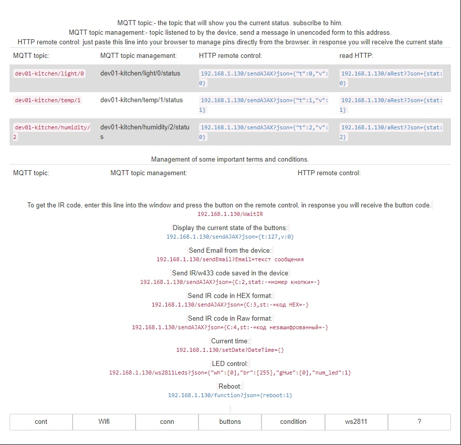

# EcoLogic Manager 🚀

Welcome to **EcoLogic Manager** – your all-in-one, no-coding-needed smart home controller for ESP8266! 

---

## ✨ Features
- Control everything with a single device
- Super easy setup – no programming skills required
- Web-based interface, works from any browser
- Flexible: 5V–12V power supply

---

## 🛠️ Quick Start

1. **Power Up**
   - Connect your ESP8266 to a 5V–12V power supply.
   - See wiring: 

2. **Get the Tools**
   - Download and install [Arduino IDE 2.3.4](https://www.arduino.cc/en/software)

3. **Board Setup**
   - In Arduino IDE: 
     - Tools → Board: `Generic ESP8266 Module` (ESP8266 Boards 3.1.2)
     - Tools → Flash Size: `4MB (FS:1MB OTA:~1019KB)`

4. **Prepare Filesystem**
   - Press `Ctrl+Shift+P` → `Upload LittleFS to Pico/ESP8266/`
   - (Optional) Update web files: run `make_gz.ps1` in PowerShell

5. **Flash the Firmware**
   - Open `EcoLogic_manager.ino` in Arduino IDE
   - Upload to your ESP8266

6. **Connect & Enjoy!**
   - Access the device via its web interface (see help page)
   - Example: 

---

## 📚 Libraries Used
- See `README.md` for library versions

---

## 🖼️ More Screenshots
- Button setup: 
- Edit page: 
- IR setup: 
- NodeMCU pinout: 

---

## 💡 Advanced
- Update files in `data/` with `make_gz.ps1`
- Explore `HTML_data/` for web UI customization
- Node-RED integration supported

---

## 🔗 Resources
- [ESP8266 Documentation](https://www.espressif.com/en/products/socs/esp8266ex/resources)
- [Project GitHub](https://github.com/spspider/EcoLogic_manager)

---

> **Vibe on!** Install, connect, and let EcoLogic Manager handle your smart home magic. ✨