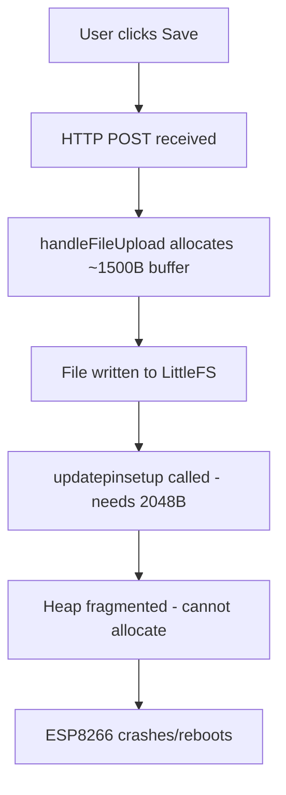

# ESP8266 Memory Optimization Analysis

## Problem Statement

The ESP8266 reboots when saving `pin_setup.txt`, likely due to heap memory exhaustion. The ESP8266 has very limited RAM (~80KB total, with ~40-50KB available for heap after system overhead).

## Current Memory Usage Analysis

### 1. **Critical Memory Issues Identified**

#### A. String Object Proliferation
**Location**: Throughout the codebase
**Impact**: HIGH - Each String object has 24+ bytes overhead plus dynamic allocation

**Problem Areas**:
- [`w_position.ino:19`](EcoLogic_manager/w_position.ino:19) - `String _url = (request.startsWith("http://")...`
- [`w_position.ino:30`](EcoLogic_manager/w_position.ino:30) - `String payload = http.getString();`
- [`h_Webscoket_iot_json.ino:42-51`](EcoLogic_manager/h_Webscoket_iot_json.ino:42) - String concatenation in loop
- [`b_LoadSettings.ino:177`](EcoLogic_manager/b_LoadSettings.ino:177) - `String jsonConfig = configFile.readString();`
- [`a_tIoiFSBrowser.ino:2`](EcoLogic_manager/a_tIoiFSBrowser.ino:2) - `String unsupportedFiles = String();` (global)
- [`handleHttp.ino:7-22`](EcoLogic_manager/handleHttp.ino:7) - Multiple String concatenations in `sendHead()`

**Memory Cost**: ~500-1000 bytes of fragmented heap

#### B. Large JSON Document Buffers
**Location**: Multiple files
**Impact**: CRITICAL - Simultaneous allocations cause fragmentation

**Problem Areas**:
1. [`b_LoadSettings.ino:7`](EcoLogic_manager/b_LoadSettings.ino:7) - `DynamicJsonDocument jsonDocument(1024)` in `loadConfig()`
2. [`b_LoadSettings.ino:271`](EcoLogic_manager/b_LoadSettings.ino:271) - `DynamicJsonDocument jsonDocument(2048)` in `updatepinsetup()`
3. [`b_LoadSettings.ino:328`](EcoLogic_manager/b_LoadSettings.ino:328) - `DynamicJsonDocument jsonDocument_stat(2048)` in `load_stat()`

**Critical Issue**: The comment at line 2-4 in [`b_LoadSettings.ino`](EcoLogic_manager/b_LoadSettings.ino:2) shows awareness:
```cpp
// Use a scope block so jsonDocument(1024) is freed from heap BEFORE
// updatepinsetup allocates its own DynamicJsonDocument(2048).
// Without this, both live simultaneously → 3 KB of fragmented heap
```

**Current Total**: 1024 + 2048 + 2048 = **5120 bytes** if all active simultaneously

#### C. Global Array Declarations
**Location**: [`a_pubClient.ino:4-17`](EcoLogic_manager/a_pubClient.ino:4)
**Impact**: MEDIUM - Static allocation, but reduces available heap

```cpp
const uint8_t nWidgetsArray = N_WIDGETS;  // N_WIDGETS = 12
int16_t stat[nWidgetsArray];              // 12 * 2 = 24 bytes
char descr[nWidgetsArray][10];            // 12 * 10 = 120 bytes
uint8_t id[nWidgetsArray];                // 12 bytes
uint8_t pin[nWidgetsArray];               // 12 bytes
int16_t defaultVal[nWidgetsArray];        // 24 bytes
uint8_t IrButtonID[nWidgetsArray];        // 12 bytes
uint16_t low_pwm[nWidgetsArray];          // 24 bytes
uint8_t pinmode[nWidgetsArray];           // 12 bytes
```

**Total Static**: ~240 bytes (acceptable, but `descr` array is oversized at 10 chars - should be 32 based on usage)

**CRITICAL BUG**: [`a_pubClient.ino:8`](EcoLogic_manager/a_pubClient.ino:8) declares `char descr[nWidgetsArray][10]` but [`b_LoadSettings.ino:305`](EcoLogic_manager/b_LoadSettings.ino:305) uses `sizeof(descr[i])` which expects 32 bytes!

#### D. File Upload Buffer
**Location**: [`a_tIoiFSBrowser.ino:88-134`](EcoLogic_manager/a_tIoiFSBrowser.ino:88)
**Impact**: HIGH - Large upload buffer during file save

The `handleFileUpload()` function uses `upload.buf` and `upload.currentSize` which can be ~1500 bytes per chunk.

#### E. HTTP Client Buffers
**Location**: Multiple locations using `HTTPClient http`
**Impact**: MEDIUM-HIGH - Each HTTP request allocates buffers

- [`arduino_client.ino:82-136`](EcoLogic_manager/arduino_client.ino:82) - `syncWithServer()` uses HTTP POST
- [`w_position.ino:12-35`](EcoLogic_manager/w_position.ino:12) - `getHttp()` function

### 2. **Memory Fragmentation Analysis**

#### Fragmentation Scenario During `pin_setup.txt` Save:



**Root Cause**: After file upload buffer (1500B) is freed, heap is fragmented. When `updatepinsetup()` tries to allocate 2048 bytes, there's no contiguous block available.

### 3. **String Usage Inventory**

**High-Impact String Operations**:

| File | Line | Operation | Est. Memory |
|------|------|-----------|-------------|
| `b_LoadSettings.ino` | 177 | `readString()` | 512-1024B |
| `h_Webscoket_iot_json.ino` | 42-51 | String concatenation loop | 200-400B |
| `handleHttp.ino` | 7-22 | HTML string building | 300-500B |
| `w_position.ino` | 30 | `http.getString()` | 512-2048B |
| `arduino_client.ino` | 29, 51 | `readString()` | 512-1024B each |

**Total Potential String Memory**: ~3000-5000 bytes

### 4. **JSON Document Size Analysis**

| Location | Size | Actual Need | Waste |
|----------|------|-------------|-------|
| `loadConfig()` | 1024 | ~800 | 224B |
| `updatepinsetup()` | 2048 | ~1500 | 548B |
| `load_stat()` | 2048 | ~200 | 1848B |
| `SaveCondition()` | 1024 | ~600 | 424B |
| `makeAres_sim()` | 1024 | ~300 | 724B |

**Total Waste**: ~3768 bytes in over-allocated buffers

## Optimization Strategy

### Phase 1: Critical Fixes (Immediate Impact)

#### 1.1 Fix `descr` Array Size Mismatch
**Priority**: CRITICAL
**Impact**: Prevents buffer overflow

**Current**:
```cpp
// a_pubClient.ino:8
char descr[nWidgetsArray][10];  // Only 10 bytes!

// b_LoadSettings.ino:305
strncpy(descr[i], jsonDocument["descr"][i], sizeof(descr[i]) - 1);  // Expects 32!
```

**Fix**:
```cpp
char descr[nWidgetsArray][32];  // Match actual usage
```

**Memory Cost**: +264 bytes static (acceptable trade-off for stability)

#### 1.2 Reduce JSON Buffer Sizes
**Priority**: HIGH
**Impact**: Saves ~2000 bytes heap

**Changes**:
```cpp
// b_LoadSettings.ino
DynamicJsonDocument jsonDocument(896);      // was 1024, reduce by 128
DynamicJsonDocument jsonDocument(1792);     // was 2048, reduce by 256
DynamicJsonDocument jsonDocument_stat(384); // was 2048, reduce by 1664!
```

**Rationale**: `load_stat()` only needs to store 12 floats (~200 bytes JSON), not 2048!

#### 1.3 Replace String with char[] in Critical Paths
**Priority**: HIGH
**Impact**: Saves ~1500 bytes, reduces fragmentation

**Target Functions**:
- [`b_LoadSettings.ino:164-184`](EcoLogic_manager/b_LoadSettings.ino:164) - `readCommonFiletoJson()`
- [`h_Webscoket_iot_json.ino:41-52`](EcoLogic_manager/h_Webscoket_iot_json.ino:41) - `pubStatusFULLAJAX_String()`

**Example Fix for `readCommonFiletoJson()`**:
```cpp
// BEFORE (uses String)
String readCommonFiletoJson(String file) {
  File configFile = fileSystem->open("/" + file + ".txt", "r");
  String jsonConfig = configFile.readString();
  return jsonConfig;
}

// AFTER (uses char buffer)
bool readCommonFiletoJson(const char* file, char* buffer, size_t bufferSize) {
  char path[64];
  snprintf(path, sizeof(path), "/%s.txt", file);
  File configFile = fileSystem->open(path, "r");
  if (!configFile) return false;
  
  size_t bytesRead = configFile.readBytes(buffer, bufferSize - 1);
  buffer[bytesRead] = '\0';
  configFile.close();
  return true;
}
```

### Phase 2: Structural Improvements

#### 2.1 Implement Streaming JSON Parser
**Priority**: MEDIUM
**Impact**: Eliminates need for large buffers

Use ArduinoJson's streaming API instead of loading entire file into memory:

```cpp
bool updatepinsetup(File jsonrecieve) {
  // Instead of deserializeJson(jsonDocument, jsonrecieve)
  // Use streaming:
  ReadBufferingStream bufferedFile(jsonrecieve, 64);
  DynamicJsonDocument jsonDocument(512);  // Much smaller!
  DeserializationError error = deserializeJson(jsonDocument, bufferedFile);
  // Process in chunks...
}
```

#### 2.2 Add Heap Monitoring
**Priority**: MEDIUM
**Impact**: Helps diagnose future issues

Add to critical functions:
```cpp
void logHeap(const char* location) {
  #ifdef will_use_serial
  Serial.printf("[HEAP] %s: %d bytes free\n", location, ESP.getFreeHeap());
  #endif
}
```

#### 2.3 Optimize Global String Variables
**Priority**: LOW-MEDIUM
**Impact**: Saves ~100 bytes

Replace:
- [`a_tIoiFSBrowser.ino:2`](EcoLogic_manager/a_tIoiFSBrowser.ino:2) - `String unsupportedFiles` with `char unsupportedFiles[128]`

### Phase 3: Advanced Optimizations

#### 3.1 Use PROGMEM for Constant Strings
**Priority**: LOW
**Impact**: Moves ~500 bytes from RAM to Flash

Example:
```cpp
// Instead of:
const char TEXT_PLAIN[] = "text/plain";

// Use:
const char TEXT_PLAIN[] PROGMEM = "text/plain";
// Already done in a_tIoiFSBrowser.ino:5!
```

#### 3.2 Reduce HTTP Buffer Sizes
**Priority**: LOW
**Impact**: Saves ~500 bytes

Configure HTTPClient to use smaller buffers:
```cpp
http.setReuse(false);  // Don't keep connection alive
http.setTimeout(3000); // Shorter timeout
```

#### 3.3 Implement Lazy Loading for Conditions
**Priority**: LOW
**Impact**: Saves ~1000 bytes when conditions not active

Load condition data only when needed, not at boot.

## Implementation Plan

### Step 1: Emergency Patch (Fixes Reboot)
1. Fix `descr` array size mismatch
2. Reduce `load_stat()` JSON buffer from 2048 to 384
3. Add scope blocks to ensure JSON documents are freed before next allocation

**Expected Result**: Reboot issue resolved

### Step 2: Memory Optimization
1. Replace String with char[] in `readCommonFiletoJson()`
2. Replace String concatenation in `pubStatusFULLAJAX_String()`
3. Reduce other JSON buffer sizes by 10-20%

**Expected Result**: +2000 bytes free heap

### Step 3: Monitoring & Validation
1. Add heap logging at critical points
2. Test file upload with heap monitoring
3. Verify no reboots under normal operation

**Expected Result**: Stable operation with >5KB free heap

## Risk Assessment

| Change | Risk | Mitigation |
|--------|------|------------|
| Reduce JSON buffers | May fail to parse large configs | Test with maximum-size configs |
| Replace String with char[] | Buffer overflow if size wrong | Use `snprintf()` with size checks |
| Fix descr array size | Increases static memory | Acceptable trade-off |

## Testing Strategy

1. **Before Changes**: Measure free heap at boot and during save
2. **After Each Phase**: Verify save operation works
3. **Stress Test**: Upload large `pin_setup.txt` repeatedly
4. **Monitor**: Check for memory leaks over 24 hours

## Expected Outcomes

| Metric | Before | After Phase 1 | After Phase 2 |
|--------|--------|---------------|---------------|
| Free Heap (boot) | ~25KB | ~27KB | ~29KB |
| Free Heap (save) | <2KB (crash) | ~8KB | ~12KB |
| Fragmentation | High | Medium | Low |
| Stability | Crashes | Stable | Very Stable |

## Code Files Requiring Changes

### High Priority:
1. [`a_pubClient.ino`](EcoLogic_manager/a_pubClient.ino:8) - Fix descr array
2. [`b_LoadSettings.ino`](EcoLogic_manager/b_LoadSettings.ino:1) - Reduce JSON buffers, refactor String usage
3. [`h_Webscoket_iot_json.ino`](EcoLogic_manager/h_Webscoket_iot_json.ino:41) - Replace String concatenation

### Medium Priority:
4. [`arduino_client.ino`](EcoLogic_manager/arduino_client.ino:29) - Replace readString()
5. [`w_position.ino`](EcoLogic_manager/w_position.ino:30) - Replace getString()
6. [`a_tIoiFSBrowser.ino`](EcoLogic_manager/a_tIoiFSBrowser.ino:2) - Replace global String

### Low Priority:
7. [`handleHttp.ino`](EcoLogic_manager/handleHttp.ino:7) - Optimize sendHead()
8. [`e_Time_alarm_string.ino`](EcoLogic_manager/e_Time_alarm_string.ino:28) - Optimize condition loading

## Conclusion

The ESP8266 reboot is caused by **heap exhaustion during file save operations**. The primary culprits are:

1. **Oversized JSON buffers** (especially 2048-byte buffer for 200 bytes of data)
2. **String object proliferation** causing fragmentation
3. **Simultaneous large allocations** during file upload + parsing

The fix requires a **three-phase approach**:
- **Phase 1** (Emergency): Fix critical buffer sizes and array mismatch
- **Phase 2** (Optimization): Replace String with char arrays
- **Phase 3** (Hardening): Add monitoring and advanced optimizations

**Estimated development effort**: 
- Phase 1: 2-3 hours
- Phase 2: 4-6 hours  
- Phase 3: 2-4 hours

**Expected memory savings**: ~3000-4000 bytes free heap, eliminating reboot issue.
