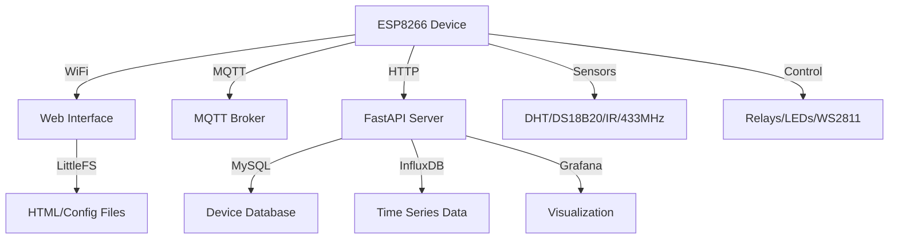

# EcoLogic Manager - Project Analysis

**Date**: 2026-05-16  
**Status**: Active Development  
**Platform**: ESP8266 (Arduino)

---

## 📊 Project Overview

**EcoLogic Manager** is a comprehensive ESP8266-based smart home controller with web interface, MQTT support, and cloud integration. It's designed as a no-coding-needed solution for home automation.

---

## 🏗️ Architecture

---

## 📁 Project Structure

### 1. **Firmware** (`EcoLogic_manager/`)
Main Arduino sketch for ESP8266 with modular architecture:

- **Core Files**:
  - `EcoLogic_manager.ino` - Main entry point, setup, loop
  - `j_essential_function.ino` - Core utilities
  - `b_LoadSettings.ino` - Configuration loading

- **Connectivity**:
  - `a_CaptivePortalAdvanced.ino` - WiFi setup portal
  - `a_pubClient.ino` - MQTT client
  - `h_Webscoket_iot_json.ino` - WebSocket communication
  - `arduino_client.ino` - HTTP client

- **Web Server**:
  - `handleHttp.ino` - HTTP request handlers
  - `a_tIoiFSBrowser.ino` - File browser
  - `d_SSDP.ino` - Device discovery

- **Features**:
  - `sendEmail.ino` - Email notifications
  - `telegram.ino` - Telegram bot integration
  - `w_position.ino` - Position/location tracking
  - `e_Time_alarm_string.ino` - Timer/alarm system
  - `a_EEPROM_file.ino` - Persistent storage

- **Hardware Support**:
  - `w_IR_recive.ino` - IR remote control
  - `w433rcv.ino` - 433MHz RF receiver
  - `ws2811.ino` - LED strip control
  - `i_compass.ino` - Compass/position sensor
  - `player.ino`, `player_mp3.ino`, `player_from_url.ino` - Audio playback
  - `f_WOL.ino` - Wake-on-LAN
  - `picoMqtt.ino` - Lightweight MQTT

### 2. **Backend Server** (`standalone_server/`)
FastAPI-based cloud backend:

- `app_fastapi.py` - Main API server (696 lines)
- `influx_logger.py` - InfluxDB time-series logging
- `grafana_user_manager.py` - Grafana integration
- `query_influx.py` - Data queries
- `docker-compose.yaml` - Container orchestration
- `Dockerfile` - Container build
- `.env.example` - Configuration template

**Features**:
- Device management with MySQL
- Time-series data storage (InfluxDB)
- User authentication
- Grafana visualization
- RESTful API for device communication

### 3. **Web Interface** (`HTML_data/`)
Browser-based configuration and control:

- `index.htm` - Main dashboard
- `home.htm` - Home page
- `pin_setup.htm` - GPIO configuration
- `wifi_setup.htm` - WiFi settings
- `IR_setup.htm` - IR remote setup
- `other_setup.htm` - General settings
- `graphs.htm` - Data visualization
- `edit.htm` - File editor
- `condition.htm` - Automation rules
- `ws2811.html` - LED strip control
- `style.css`, `style_pin_setup.css` - Styling

### 4. **Documentation**
- `README.md` - Quick start guide
- `EcoLogic_manager/README.md` - Detailed firmware docs
- `SETTINGS.md` - Configuration examples
- `scheme-instrctions/` - Wiring diagrams (PDF, DOCX)
- `drawio-scheme/` - Architecture diagrams
- `pictures/` - Screenshots and photos

### 5. **Development Tools**
- `make_gz.ps1`, `make_gz.sh` - Compress web files
- `git_push.bat`, `gitpush.sh`, `push.bat` - Version control
- `docker_push.sh` - Container deployment
- `docker-build/` - Build scripts

---

## ⚙️ Current Configuration

Based on `EcoLogic_manager.ino` (lines 1-23):

### Active Features ✅
- `will_use_serial` - Serial debugging
- `timerAlarm` - Timer/alarm system
- `USE_LITTLEFS` - LittleFS filesystem
- `USE_DNS_SERVER` - Captive portal DNS
- `USE_DHT` - DHT temperature/humidity sensor
- `USE_EMON` - Energy monitoring

### Disabled Features ❌
- `ws2811_include` - LED strips
- `use_telegram` - Telegram bot
- `USE_SPIFFS` - Old filesystem (migrated to LittleFS)
- `USE_DS18B20` - Dallas temperature sensor
- `USE_UDP` - UDP communication
- `USE_PUBSUBCLIENT` - MQTT
- `USE_IRUTILS` - IR remote (conflicts with EMON)
- `USE_PLAY_AUDIO_WAV/MP3` - Audio playback
- `USE_TINYMQTT/PICOMQTT` - Alternative MQTT
- `USE_AS5600` - Compass sensor
- `wakeOnLan` - Wake-on-LAN
- `ads1115` - ADC sensor
- `ws433` - 433MHz RF

### Pin Configuration
- `ONE_WIRE_BUS` = 2 (D4) - DS18B20 sensor
- `RECV_PIN` = 5 (D1) - IR receiver
- `SEND_PIN` = 4 (D2) - IR transmitter
- `RESET_PIN` = 5 (D1) - Reset button
- `DHT_PIN` = 2 (D4) - DHT sensor
- `N_WIDGETS` = 12 - Max UI widgets
- `MAX_CONDITIONS` = 5 - Max automation rules

---

## 🔧 Development Environment

- **IDE**: Arduino IDE 2.3.4
- **Board**: Generic ESP8266 Module
- **ESP8266 Core**: 3.1.2 (upgraded from 2.6.3)
- **Flash Size**: 4MB (FS:1MB OTA:~1019KB)
- **Filesystem**: LittleFS (migrated from SPIFFS on 2024.12.28)

### Required Libraries
- ArduinoJson 6.15.2
- CTBot 2.1.14 (Telegram)
- DallasTemperature 3.9.0
- DHT sensor library for ESPx 1.19
- EmonLib 1.1.0 (Energy monitoring)
- FastLED 3.2.9
- IRremoteESP8266 2.3.2
- MAX6675 library 1.0.0
- OneWire 2.3.8
- PubSubClient 2.8 (MQTT)
- rc-switch 2.6.2 (433MHz)
- Time 1.6
- WakeOnLan 1.1.6
- WiFiManager 2.0.17

---

## 🎯 Current Work Context

### Open Files (VSCode Tabs)
1. `w_position.ino` - Position/location tracking
2. `EcoLogic_manager.ino` - Main firmware
3. `a_pubClient.ino` - MQTT client
4. `sendEmail.ino` - Email functionality
5. `h_Webscoket_iot_json.ino` - WebSocket/IoT
6. `a_CaptivePortalAdvanced.ino` - WiFi portal

**Analysis**: Focus appears to be on **connectivity features** (MQTT, WebSocket, WiFi) and **notification systems** (email, position tracking).

---

## 💪 Project Strengths

1. **Modular Architecture** - Clean separation of concerns with `.ino` files
2. **Flexible Configuration** - Web-based setup, no code changes needed
3. **Multiple Integration Options** - MQTT, HTTP, WebSocket, Telegram
4. **Professional Backend** - FastAPI + MySQL + InfluxDB + Grafana
5. **Docker Ready** - Container deployment supported
6. **Good Documentation** - READMEs, diagrams, screenshots
7. **Active Development** - Recent migration to LittleFS, Arduino IDE 2.x
8. **Hardware Flexibility** - Support for many sensors and actuators

---

## 🔍 Potential Improvements

### Code Quality
1. **Deprecated Defines** - Some old naming conventions:
   - `ads1115` → should be `USE_ADS1115`
   - `ws433` → should be `USE_WS433`

2. **Configuration Management**:
   - `SETTINGS.md` contains multiple device configs - could be split into separate files
   - Consider JSON-based configuration files

3. **Code Organization**:
   - Some files are very large (e.g., `app_fastapi.py` - 696 lines)
   - Could benefit from further modularization

### Documentation
1. **Missing Architecture Docs**:
   - No `/plans` directory exists
   - Could add sequence diagrams for key workflows
   - API documentation could be more detailed

2. **Code Comments**:
   - Some files have mixed language comments (English/Russian)
   - Standardize to English for broader accessibility

### Features
1. **Security**:
   - Review authentication mechanisms
   - Add HTTPS support documentation
   - Secure MQTT configuration guide

2. **Testing**:
   - No visible test suite
   - Could add unit tests for backend
   - Integration tests for device-server communication

3. **Monitoring**:
   - Add health check endpoints
   - Device status monitoring
   - Error logging and alerting

---

## 📋 Common Use Cases

Based on file structure and configuration:

1. **Home Automation Controller**
   - GPIO relay control
   - Temperature/humidity monitoring
   - Timer-based automation

2. **Energy Monitor**
   - Power consumption tracking
   - InfluxDB logging
   - Grafana visualization

3. **IR Remote Hub**
   - Learn and replay IR codes
   - Control appliances

4. **Multi-Device Manager**
   - Centralized backend
   - Multiple ESP8266 devices
   - Unified dashboard

---

## 🚀 Next Steps Recommendations

### Immediate
1. Create architecture documentation in `/plans`
2. Standardize naming conventions (USE_* prefix)
3. Document API endpoints

### Short-term
1. Add automated testing
2. Improve error handling
3. Create deployment guide

### Long-term
1. Add OTA update management
2. Implement device groups
3. Mobile app development

---

## 📞 Support Resources

- **ESP8266 Docs**: https://www.espressif.com/en/products/socs/esp8266ex/resources
- **Project GitHub**: https://github.com/spspider/EcoLogic_manager
- **Arduino IDE**: https://www.arduino.cc/en/software

---

*This analysis was generated on 2026-05-16. Project is actively maintained and evolving.*
